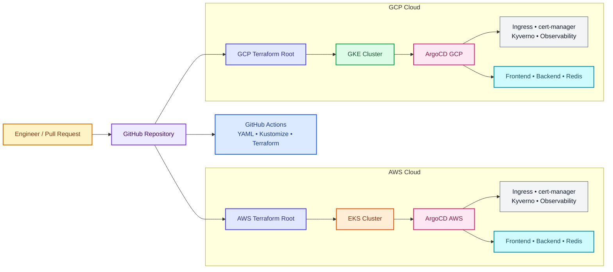

# Multi-Cloud GitOps Platform

## Overview

`multicloud-gitops` is a Terraform and ArgoCD platform for running the same
workload stack across AWS EKS and GCP GKE. It supports development, staging,
and production environments while keeping infrastructure and application
delivery declarative.

The current operating model uses **two independent ArgoCD instances**:

- one ArgoCD instance bootstrapped in AWS EKS
- one ArgoCD instance bootstrapped in GCP GKE
- shared GitOps sources with environment/cloud-specific ApplicationSets

This repository has been validated locally without creating AWS or GCP
resources.

## Problem Statement

Teams operating Kubernetes across multiple cloud providers commonly face:

- duplicated cluster and application configuration
- inconsistent promotion between environments
- manual drift caused by direct cluster changes
- unclear ownership between Terraform and Kubernetes tooling
- cloud-specific secrets and state being mixed together
- difficult local validation before cloud deployment

This project addresses those problems with modular Terraform, App-of-Apps,
ApplicationSets, policy-as-code, environment overlays, and automated
validation.

## Objectives

- Provision repeatable AWS EKS and GCP GKE foundations.
- Install ArgoCD declaratively in each cluster.
- Deploy frontend, backend, and Redis consistently across clouds.
- Support dev, staging, and production overlays.
- Keep Terraform state isolated per environment and cloud.
- Enforce workload policies with Kyverno.
- Validate manifests and Terraform locally and in CI.
- Avoid cloud access during local development and testing.

## Architecture

### Current architecture: independent ArgoCD instances



### Ownership boundaries

| Layer | Owner | Change mechanism |
|---|---|---|
| VPC, EKS, GKE, node pools, IAM, ArgoCD installation | Terraform | Deliberate Terraform execution |
| Cluster add-ons and workloads | ArgoCD | Git change through ApplicationSets |
| Policies | Kyverno through ArgoCD | Versioned policy manifest |
| CI validation | GitHub Actions | Pull request or protected branch workflow |

### Next phase: single-control-plane evolution

The future design may host one ArgoCD control plane in one cluster and register
the other cluster as an external target. That model provides centralized
visibility, but requires secure cross-cloud cluster credentials, stronger
RBAC, and a deliberate external-secrets strategy. The trade-off is documented
in [ARCHITECTURE.md](ARCHITECTURE.md).

## Technologies

- **Infrastructure:** Terraform, AWS EKS, GCP GKE, VPC/VPC networking
- **Cloud identity:** AWS IRSA/OIDC, GCP Workload Identity
- **GitOps:** ArgoCD, App-of-Apps, ApplicationSets
- **Workloads:** Kubernetes, Kustomize, frontend, backend, Redis StatefulSet
- **Platform services:** ingress-nginx, cert-manager, Kyverno
- **Observability:** kube-prometheus-stack Application, Prometheus/Grafana
- **Validation:** Terraform validate, kubeconform, yamllint, kubectl, Kustomize
- **CI/CD:** GitHub Actions
- **Supply chain:** Trivy filesystem scanning and CycloneDX SBOM artifacts
- **Local testing:** kind and Docker (optional, disposable)

## Security Considerations

- Do not commit cloud credentials, kubeconfig files, Terraform state, or
  plaintext secrets.
- Use separate Terraform state per cloud and environment.
- Use AWS IRSA and GCP Workload Identity instead of static pod credentials.
- Keep ArgoCD cluster credentials scoped to the cluster they manage.
- Redis credentials are represented by a secret contract, not committed values.
- Use Kyverno to enforce CPU and memory requests/limits on application
  workloads.
- Review ArgoCD projects, destination restrictions, repository access, and
  sync permissions before production use.
- Use private cluster endpoints, network policies, and encrypted state where
  supported by the target platform.

## Implementation

### Infrastructure

- `terraform/modules/eks` provisions AWS networking, EKS, node groups, and
  IRSA/OIDC-related resources.
- `terraform/modules/gke` provisions GCP networking, GKE, node pools, and
  Workload Identity resources.
- `terraform/modules/argocd` installs ArgoCD through Helm and applies the root
  App-of-Apps Application.
- Independent roots exist under
  `terraform/environments/{dev,staging,prod}/{aws,gcp}`.

### GitOps

- `gitops/root-app-of-apps.yaml` is the Terraform-rendered bootstrap object.
- `gitops/clusters/*.yaml` contains six environment/cloud ApplicationSets.
- ApplicationSets select Kustomize overlays for frontend, backend, and Redis.
- Infrastructure and policy Applications are synced by the root Application.
- `gitops/platform/workloads` defines namespace quotas and default limits.
- `gitops/secrets` contains disabled External Secrets templates only.

## Testing

Completed local validation includes:

- YAML parsing for ApplicationSets, infrastructure, and policy manifests.
- Server-side dry-run of all six ApplicationSets against local ArgoCD CRDs.
- Kustomize rendering for all nine environment overlays.
- Terraform validation for all six environment roots.
- Local ArgoCD synchronization using a disposable kind cluster and Git mirror.
- Kyverno rejection test for a workload without resource limits.
- Supply-chain checks are defined for filesystem vulnerabilities, secrets,
  misconfiguration, and repository SBOM generation.

Safe validation commands:

```bash
# No cloud access: configuration validation only
for root in \
  terraform/environments/dev/aws \
  terraform/environments/dev/gcp \
  terraform/environments/staging/aws \
  terraform/environments/staging/gcp \
  terraform/environments/prod/aws \
  terraform/environments/prod/gcp; do
  terraform -chdir="$root" validate
done

# Local manifest rendering
for overlay in \
  gitops/apps/frontend/overlays/{dev,staging,prod} \
  gitops/apps/backend/overlays/{dev,staging,prod} \
  gitops/apps/redis/overlays/{dev,staging,prod}; do
  kubectl kustomize "$overlay" >/dev/null
done
```

Do not run AWS CLI, or GCP CLI commands during local-only testing.

## Results

- Multi-cloud Terraform structure exists for AWS EKS and GCP GKE.
- Six environment/cloud ApplicationSets are implemented.
- Workload overlays render successfully.
- Policy and observability integrations are represented as GitOps Applications.
- Workload governance, PDBs, topology spreading, and security policies are
  included in the declarative baseline.
- Disaster recovery, promotion, and troubleshooting runbooks are included.
- CI validates all environment Terraform roots and GitOps overlays.
- Local test resources were removed after validation.
- No AWS or GCP resources were created during local development.

## Limitations

- Real EKS/GKE deployment has not been performed in this validation session.
- Full Terraform plans require cloud-provider credentials and may contact cloud
  APIs; they were intentionally not run.
- Remote S3/GCS backends are documented but not configured with real buckets.
- External Secrets Operator is not yet wired to AWS Secrets Manager or GCP
  Secret Manager.
- Redis is single-replica per cluster; cross-cloud active-active replication is
  not automatic.
- The local kind node was too small for the full observability stack, so its
  local tuning was temporary and documented separately.

## Future Improvements

1. Enable and validate the External Secrets Operator templates per cloud.
2. Define an explicit active-active, active-passive, or split-by-service policy.
3. Add cross-cloud traffic management and DNS/failover strategy.
4. Configure production remote state backends and locking.
5. Add OpenTelemetry, OpenCost, and Kepler integrations where required.
6. Implement the documented single-control-plane ArgoCD evolution.
7. Add image signing, digest enforcement, and admission signature verification.
8. Exercise the disaster-recovery runbook with restore testing.

## Installation

### Local, no-cloud validation

Use the validation commands in [Testing](#testing). This path does not create
cloud resources.

### Cloud deployment

Cloud deployment is intentionally separate and requires explicit credentials,
backend configuration, review, and cost approval. For each environment/cloud:

```bash
terraform -chdir=terraform/environments/dev/aws init \
  -backend-config=backend.hcl
terraform -chdir=terraform/environments/dev/aws plan
terraform -chdir=terraform/environments/dev/aws apply
```

Repeat with the appropriate GCP root and environment only after verifying the
target account/project and intended resources.

## Usage

1. Create a pull request for infrastructure or GitOps changes.
2. Let CI validate Terraform, YAML, and Kustomize output.
3. Merge the reviewed change into the configured Git branch.
4. ArgoCD in each target cluster reconciles its own ApplicationSet.
5. Inspect sync and health status with:

```bash
kubectl -n argocd get applications
kubectl -n argocd get applicationsets
```

## Project Structure

```text
.
├── .github/workflows/
│   ├── app-ci.yml
│   └── terraform-ci.yml
├── terraform/
│   ├── environments/{dev,staging,prod}/{aws,gcp}/
│   └── modules/
│       ├── eks/
│       ├── gke/
│       └── argocd/
├── gitops/
│   ├── root-app-of-apps.yaml
│   ├── clusters/                 # six environment/cloud ApplicationSets
│   ├── apps/                    # Kustomize overlays and values
│   ├── infrastructure/          # cluster add-on Applications
│   ├── policies/                # Kyverno policy and Application
│   └── observability/           # local testing and operating notes
├── k8s-manifests/
│   ├── frontend/
│   ├── backend/
│   └── redis/
├── gitops/platform/workloads/   # quotas, limits, and workload governance
├── gitops/secrets/              # disabled cloud secret templates
├── docs/                        # DR, promotion, and troubleshooting runbooks
├── ARCHITECTURE.md
└── scripts/
```

## Demo

The local demonstration used a disposable kind cluster, local ArgoCD, a temporary Git mirror, and server-side
Kubernetes dry-runs. The cluster and temporary Git daemon were deleted after testing.

## References

- [ArgoCD ApplicationSets](https://argo-cd.readthedocs.io/en/stable/user-guide/application-set/)
- [ArgoCD App-of-Apps pattern](https://argo-cd.readthedocs.io/en/stable/operator-manual/cluster-bootstrapping/)
- [Terraform AWS provider](https://registry.terraform.io/providers/hashicorp/aws/latest/docs)
- [Terraform Google provider](https://registry.terraform.io/providers/hashicorp/google/latest/docs)
- [Amazon EKS](https://docs.aws.amazon.com/eks/)
- [Google Kubernetes Engine](https://cloud.google.com/kubernetes-engine/docs)
- [Kyverno](https://kyverno.io/docs/)
- [Kustomize](https://kubectl.docs.kubernetes.io/references/kustomize/)

## License

This project is licensed under the MIT License. See [LICENSE](LICENSE) for
the complete license text.
