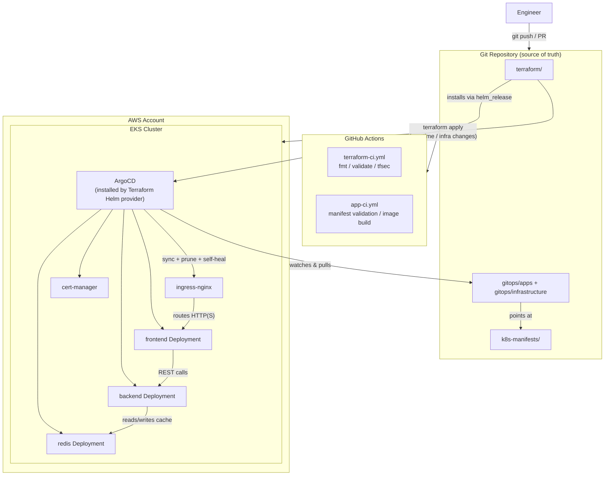

# Multi-Cloud GitOps & Infrastructure Platform

An end-to-end, self-healing infrastructure repository. Terraform builds the
cluster and installs ArgoCD. From that point on, **Git is the only thing
anyone touches** — ArgoCD does the rest.

- **Infrastructure:** Terraform (AWS EKS, VPC, IRSA/OIDC, S3 remote state)
- **GitOps controller:** ArgoCD, installed by Terraform's Helm provider (App-of-Apps pattern)
- **Workload:** Frontend + Backend API + Redis cache, three plain Kubernetes microservices
- **Automation:** GitHub Actions for Terraform linting/validation/security scanning, plus manifest validation and image builds

> **Scope note:** the task that generated this repo mentioned a GCP/GKE
> module in its opening summary, but the file tree it asked for only
> specifies an AWS/EKS module — that's what is implemented below. Adding a
> `terraform/modules/gke` module that mirrors `modules/eks` (VPC, cluster,
> node pool, Workload Identity instead of IRSA) is a natural next step if
> you want true multi-cloud; happy to add it on request.

---

## 1. Architecture



**Two different control loops, on purpose:**

| Layer | Owned by | Changed by |
|---|---|---|
| VPC, EKS cluster, node group, ArgoCD install | Terraform | `terraform apply` (rare — infra changes) |
| Everything running *inside* the cluster (apps, ingress-nginx, cert-manager) | ArgoCD | `git push` (constant — day-to-day changes) |

Terraform's job ends the moment ArgoCD is up and the root `Application` is
applied. After that, Terraform never touches the cluster's workloads again —
ArgoCD owns them.

---

## 2. Repository layout

```
.
├── .github/workflows/       # CI: terraform lint/validate/security, manifest validation, image builds
├── terraform/                # Root module: wires eks + argocd modules together
│   └── modules/
│       ├── eks/               # VPC, subnets, NAT, EKS cluster, managed node group, OIDC/IRSA
│       └── argocd/             # Installs ArgoCD via Helm, applies the root App-of-Apps
├── gitops/
│   ├── root-app-of-apps.yaml   # The ONE manifest Terraform applies by hand
│   ├── infrastructure/          # ArgoCD Applications for cluster add-ons (ingress-nginx, cert-manager)
│   └── apps/                     # ArgoCD Applications for the microservices
├── k8s-manifests/               # Plain Kubernetes YAML the apps/ Applications point at
│   ├── frontend/
│   ├── backend/
│   └── redis/
└── scripts/bootstrap.sh          # One command: cluster up -> kubeconfig -> secret -> verify sync
```

---

## 3. Prerequisites

- An AWS account with permission to create VPCs, EKS clusters, and IAM roles
- Terraform >= 1.6
- AWS CLI v2, authenticated (`aws sts get-caller-identity` should work)
- `kubectl`
- An S3 bucket + DynamoDB table for Terraform's remote state lock (see `terraform/providers.tf`)
- A fork of this repository (ArgoCD needs a Git URL it can reach)

---

## 4. Step-by-step deployment

### Step 1 — Fork and point the manifests at your fork

ArgoCD needs to clone *your* copy of this repo, not the original. Replace
the placeholder `repoURL` in these three files with your fork's clone URL:

```
gitops/apps/frontend.yaml
gitops/apps/backend.yaml
gitops/apps/redis.yaml
```

### Step 2 — Configure Terraform

```bash
cd terraform
cp terraform.tfvars.example terraform.tfvars
# edit terraform.tfvars: set git_repo_url to your fork, adjust region/sizing as needed

terraform init -backend-config="bucket=<your-state-bucket>" \
                -backend-config="key=multicloud-gitops/terraform.tfstate" \
                -backend-config="region=<your-region>" \
                -backend-config="dynamodb_table=<your-lock-table>"
```

### Step 3 — Run the bootstrap script

```bash
cd ..
./scripts/bootstrap.sh
```

This single script:
1. Runs `terraform validate` and `terraform apply` — creates the VPC, EKS cluster, node group, and installs ArgoCD via the Helm provider, then applies the root `Application`.
2. Runs `aws eks update-kubeconfig` so your local `kubectl` can reach the new cluster.
3. Creates the `redis-credentials` Secret (see **Secrets**, below) if it doesn't already exist.
4. Polls the root `Application` until ArgoCD reports it `Synced` and `Healthy`, then lists every Application it is now managing.

### Step 4 — Watch ArgoCD take over

```bash
kubectl -n argocd port-forward svc/argocd-server 8080:443
# open https://localhost:8080
# username: admin
# password: kubectl -n argocd get secret argocd-initial-admin-secret -o jsonpath='{.data.password}' | base64 -d
```

You'll see `ingress-nginx`, `cert-manager`, `frontend`, `backend`, and `redis`
Applications appear automatically — nobody ran `kubectl apply` on any of them.

### Step 5 — Tear down

```bash
terraform -chdir=terraform destroy
```

---

## 5. Secrets

`k8s-manifests/backend/deployment.yaml` and `k8s-manifests/redis/deployment.yaml`
both read a Redis password from a Secret named `redis-credentials` via
`secretKeyRef` — the password is never written in plain text in any file
ArgoCD syncs.

That Secret is **intentionally not a file in this repository.**
`scripts/bootstrap.sh` creates it once, with a randomly generated value, the
first time you bootstrap. Committing a real Secret object to Git — even
"just for now" — defeats the purpose of a Secret.

For a real production fork, replace that manual step with one of:
- **Sealed Secrets** — encrypt the value locally with `kubeseal`, commit the
  resulting `SealedSecret` CRD (safe, since only the in-cluster controller
  can decrypt it), add the sealed-secrets controller as another
  `gitops/infrastructure/*.yaml` Application.
- **External Secrets Operator** — sync the value from AWS Secrets Manager /
  SSM Parameter Store into a Secret automatically, no manual step at all.

---

## 6. How GitOps prevents drift

This is the property that makes ArgoCD worth using instead of a deploy script,
and it's the section a technical screener will usually ask about first.

**The problem GitOps solves:** in a traditional pipeline, `kubectl apply` or
`helm upgrade` changes the cluster *once*, at deploy time. If someone later
runs a manual `kubectl edit`, a hotfix `kubectl scale`, or a well-meaning
"just this once" change directly against the cluster, nothing detects it.
The cluster's real state quietly drifts away from what's in Git, and Git
stops being trustworthy.

**How this repo prevents it, concretely:**

1. **Git is the only accepted input.** Every Application in `gitops/apps/`
   and `gitops/infrastructure/` has `syncPolicy.automated` set — ArgoCD's
   controller continuously diffs the live cluster state against the
   manifests in Git, not the other way around.
2. **`selfHeal: true` reverts manual changes automatically.** If anyone runs
   `kubectl scale deployment/backend --replicas=10` by hand, ArgoCD notices
   the live state no longer matches Git within its next reconciliation loop
   (default: every few minutes, or immediately on webhook) and scales it
   back to whatever Git says. The cluster cannot stay drifted.
3. **`prune: true` deletes what Git no longer defines.** Delete a YAML file
   from `k8s-manifests/frontend/`, merge that PR, and the corresponding
   object disappears from the cluster on the next sync — no orphaned
   resources lingering from a forgotten manual `kubectl apply`.
4. **The `Synced` / `Healthy` status is queryable and provable.** Anyone —
   an auditor, a teammate, a screener — can run
   `kubectl -n argocd get applications` and get an honest, live answer to
   "does the cluster actually match Git right now?" There's no need to trust
   a deploy log or a Slack message; the controller's own state *is* the
   audit trail.
5. **Rollback is a `git revert`, not a runbook.** Because the cluster is a
   pure function of the Git tree ArgoCD is pointed at, undoing a bad change
   is the same operation as undoing a bad commit anywhere else — no
   cluster-specific tribal knowledge required.

The only manual step in this entire repository, ever, is the very first
`terraform apply` that installs ArgoCD and applies the root `Application`.
Everything after that is GitOps.

---

## 7. Application services

`frontend/` and `backend/` are minimal, deliberately simple Node.js apps —
just enough to prove the whole system (Ingress → frontend → backend →
Redis) actually works end to end. Swap either one for your real
application whenever you have it; keep the same port, env vars, and
`/healthz` contract and nothing else in this repo needs to change.

| | Frontend | Backend |
|---|---|---|
| Port | 8080 (non-root, can't bind 80 — see the comment in `k8s-manifests/frontend/deployment.yaml`) | 8080 |
| Reads | `BACKEND_API_URL` | `REDIS_HOST`, `REDIS_PORT`, `REDIS_PASSWORD` |
| Probe path | `/` | `/healthz` |
| Dependencies | none (built-in `http` + `fetch`) | `redis` npm client |

What it does: `GET /` on the frontend calls `GET /api/count` on the backend,
which runs `INCR` against Redis and returns the running total. The frontend
renders it in a plain HTML page. Both sides are written to **fail
gracefully, never crash**: if the backend is down, the frontend still
returns `HTTP 200` (with a visible "backend unreachable" message) instead
of failing its own probe; if Redis is down, the backend's `/healthz` still
returns `200` while `/api/count` returns `503` — a downstream outage never
takes an otherwise-healthy pod out of rotation.

**Run either one directly with Node** (fastest inner loop, no Docker):
```bash
cd backend && npm install
REDIS_HOST=localhost REDIS_PORT=6379 REDIS_PASSWORD=<yours> PORT=8080 npm start
# in another terminal:
cd frontend && BACKEND_API_URL=http://localhost:8080 PORT=8081 npm start
curl http://localhost:8081/
```

**Build the images locally:**
```bash
docker build -t frontend:local ./frontend
docker build -t backend:local ./backend
```

**Load them into a local `kind` cluster** (kind can't see your local Docker
images otherwise):
```bash
kind load docker-image frontend:local --name gitops-local
kind load docker-image backend:local --name gitops-local
kubectl -n workloads set image deployment/frontend frontend=frontend:local
kubectl -n workloads set image deployment/backend backend=backend:local
```

---

## 8. CI/CD

- **`terraform-ci.yml`** — on every PR touching `terraform/`: `terraform fmt -check`,
  `terraform validate`, and a `tfsec` security scan, with results posted as a
  PR comment. A second job auto-merges the PR (via GitHub's native auto-merge,
  gated on the checks above passing) — but only for Dependabot PRs or PRs a
  human has explicitly labeled `automerge`. Nothing merges itself without
  either passing checks *and* an explicit trust signal.
- **`app-ci.yml`** — validates every file under `k8s-manifests/` and `gitops/`
  with `yamllint` and `kubeconform` on every PR. On merges to `main`, it also
  builds and pushes `frontend`/`backend` container images to GHCR at exactly
  the tags `k8s-manifests/*/deployment.yaml` already expect
  (`ghcr.io/<owner>/frontend:latest`, `ghcr.io/<owner>/backend:latest`, plus
  a `:<git-sha>` tag) — now that both directories have a `Dockerfile`, this
  job runs for real instead of skipping.

---

## 9. Known follow-ups before this is truly production-ready

- If you change `argocd_namespace` away from the default `"argocd"` in
  `terraform.tfvars`, also update `metadata.namespace: argocd` in
  `gitops/apps/*.yaml` and `gitops/infrastructure/*.yaml` — those five files
  are static (ArgoCD discovers them as-is, not through Terraform's
  `templatefile()`), so they don't pick up the variable automatically.
- Create a `ClusterIssuer` named `letsencrypt-prod` (referenced by
  `k8s-manifests/frontend/ingress.yaml`) with your own ACME email address —
  intentionally left out of Git rather than committed with a placeholder
  email that would silently be wrong.
- ~~Replace the `ghcr.io/your-org/frontend:latest` / `backend:latest` image
  placeholders~~ — done. `frontend/` and `backend/` now contain minimal,
  tested placeholder apps (see **Application services**, above).
  `app-ci.yml`'s build job will produce real images at those exact tags
  automatically once you push to `main`.
- Add a `terraform/modules/gke` module if you want the GCP side of "multi-cloud."
- Consider Sealed Secrets or External Secrets Operator instead of the manual
  `redis-credentials` step (see **Secrets**, above) once you have more than
  one engineer running bootstrap.
